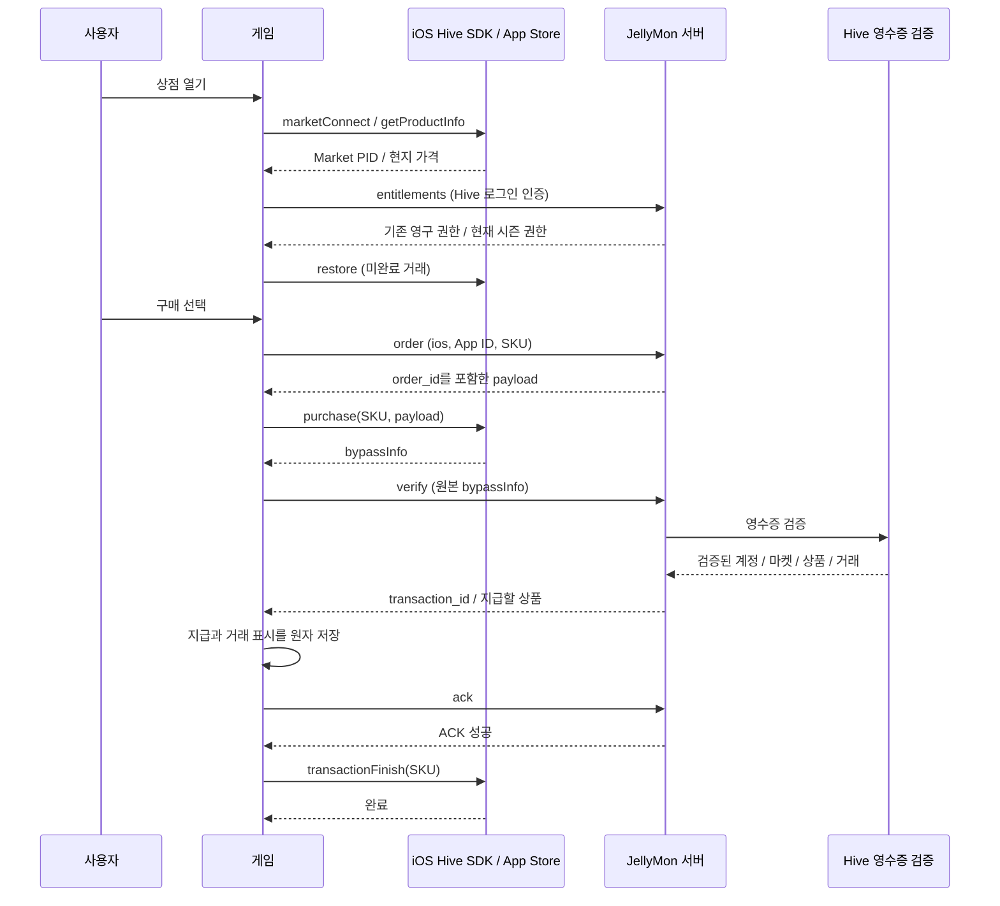

# JellyMon iOS · Hive IAP v4 결제 적용 및 출시 가이드

작성일: 2026-09-11. 기준: 이 저장소의 Godot 4.7, Hive SDK 26.4.0, iOS 최소 버전 14.0.

## 1. 현재 완료된 것과 운영자가 진행할 것

**게임·네이티브 브리지·서버 코드는 연결했다. 실제 판매 활성화, 콘솔 상품 등록, Apple Sandbox 거래는 아직 진행하지 않았다.** 이 문서의 체크리스트를 완료한 뒤 판매를 열어야 한다.

| 영역 | 적용 내용 |
|---|---|
| iOS Hive 브리지 | App Store 초기화/마켓 선택, 상품 가격 조회, 구매, 미완료 거래 복원, 거래 완료 |
| 게임 공통 결제 | iOS 상품 ID와 App Store 문구 사용, Apple 플랫폼/App ID 전송, 응답 단계와 계정 확인 |
| 서버 | Apple StoreKit 1·2 검증 결과 해석, 번들/상품/계정/주문 확인, Google과 거래 분리 |
| 지급 | 서버 검증 후 기기 원자 저장, 서버 ACK 후에만 Hive 거래 완료 |
| 복원 | 미완료 거래 재처리와 서버에 기록된 소유권 복원, 이미 지급된 재화 중복 지급 방지 |
| 배포 | iOS 실기기/시뮬레이터용 XCFramework 재빌드, Docker 상품 카탈로그 포함 및 환경변수 전달 |
| 외부 작업 | Apple/Hive 콘솔 등록, 서버 환경변수 적용·배포, 테스트 결제·TestFlight·심사는 별도 수행 필요 |

가장 빠른 진행 순서는 **ID 확정 → Apple 상품 등록 → Hive 스토어 키/상품 매핑 → 서버 배포 → 앱 빌드 → 실기기 Sandbox 구매·복원 → TestFlight → 출시 심사**다.

현재 일반 단건 결제만 연결한다. 시즌 패스도 자동 갱신 구독이 아니다. StoreKit을 별도로 추가해 Hive와 이중으로 구매/거래 완료를 처리하지 않는다. Hive가 제공하는 구매와 완료 API를 사용한다. [Hive 결제 개요](https://developers.hiveplatform.ai/en/latest/dev/billing/)

## 2. 식별자와 환경부터 맞추기

| 항목 | 현재 저장소 값/위치 | 확인할 내용 |
|---|---|---|
| iOS Bundle ID | `com.jellymontest.game` | `export_presets.cfg` iOS의 `application/bundle_identifier` |
| iOS Hive App ID | `com.jellymontest.game` | `native/hive_ios/hive_config.xml`의 `appId` |
| 게임 iOS 설정 | `assets/data/platform_services.json` → `ios.bundle_id` | 현재 Bundle ID와 동일 |
| Apple 개발 팀 | `XZNDHJ52PQ` | 프로젝트에 설정된 값이며 실제 배포 권한 확인 필요 |
| Hive 마켓 | `AP` | iOS XML의 `market` |
| Hive 환경 | `sandbox` | XML, 게임 JSON, 서버가 같은 환경을 사용 |
| 광고 | `test_ads: true` | 결제 환경과 별개이며 출시 전에 광고도 별도 전환 |
| Android App ID | `com.jellymon.game` | iOS 테스트 App ID와 혼동하지 않는다 |
| 서버 주소 | JSON의 `ranking.api_base_url` | 랭킹·결제가 공용으로 사용. 현재 ngrok 주소는 개발용 |
| 상품 ID | `assets/data/item.json`의 `ios_product_id` | App Store Connect Product ID 및 Hive Market PID와 일치 |

### 2.1 Hive App ID와 Bundle ID가 다른 경우

두 값을 같은 것으로 가정해서 서버 검증을 완화하지 않는다. 아래처럼 별도로 지정한다.

```json
{
  "ios": {
    "bundle_id": "실제.Apple.Bundle.ID",
    "hive_app_id": "실제.Hive.App.ID"
  }
}
```

이는 `platform_services.json`의 해당 필드만 설명하는 예시이며, 나머지 `ios` 설정을 삭제하지 않는다. `ios.hive_app_id`를 생략하면 기존처럼 `ios.bundle_id`를 Hive App ID로 사용한다. 네이티브 XML의 `appId`도 Hive App ID로 맞춘다.

서버는 `HIVE_IAP_IOS_APP_ID`를 로그인/주문 식별자로, `HIVE_IAP_IOS_BUNDLE_ID`를 Apple 검증 결과의 번들 확인에 사용한다. `HIVE_ALLOWED_APP_IDS`에도 iOS Hive App ID를 등록한다.

정식 Bundle ID를 변경한다면 Apple 앱 레코드, 서명, Hive 앱 등록, XML 두 사본, JSON, 서버 환경변수를 함께 검토한다. 테스트 DB와 운영 DB를 분리하며, 기존 테스트 구매가 운영 권한으로 자동 이전된다고 가정하지 않는다.

## 3. Apple 개발자 계정과 앱 준비

1. Apple Developer 계정에서 실제 사용할 Explicit App ID/Bundle ID를 확인한다.
2. App Store Connect에 동일 Bundle ID의 iOS 앱 레코드를 준비한다.
3. 유료 앱 계약, 세금, 은행 정보의 미완료 항목을 처리한다. 무료 다운로드 게임이라도 유료 IAP 판매 준비가 필요하다.
4. Xcode의 Signing & Capabilities에서 팀·Bundle Identifier·프로비저닝이 해당 앱과 일치하는지 확인한다.
5. 앱의 In-App Purchase 사용 설정을 확인한다. 상품을 조회할 실제 개발 서명 빌드를 준비한다.

계약과 상품 유형에 대한 기준은 [Apple IAP 설정 개요](https://developer.apple.com/help/app-store-connect/configure-in-app-purchase-settings/overview-for-configuring-in-app-purchases)를 따른다. 이 문서는 개발자 계정의 계약 완료 여부를 확인한 결과가 아니다.

## 4. App Store 상품 등록

앱에서 사용하는 원본은 `assets/data/item.json`, 서버 배포 사본은 `server/leaderboard/config/iap-products.json`이다. 두 파일은 서버 테스트에서 동일성을 검사한다.

### 4.1 등록할 8개 상품

아래 Apple 유형은 현재 게임의 지급 정책에 맞춘 등록안이다. 영구 권한과 1회성 보너스가 섞인 패키지는 구성/복원 설명을 명확히 기재하고, 실제 Hive 상품 조회·복원까지 테스트한다.

| Product ID / Hive Market PID | 상품명 | Apple 등록 유형 | 게임 기준가 | 지급/복원 정책 |
|---|---|---|---:|---|
| `jellymon.stardust.50` | 별가루 50개 | Consumable | ₩1,000 | 50개 지급, 반복 구매 |
| `jellymon.stardust.110` | 별가루 110개 | Consumable | ₩2,000 | 110개 지급, 반복 구매 |
| `jellymon.energy.5` | 하트 5개 | Consumable | ₩500 | 하트 5개, 상한 초과 보유 가능 |
| `jellymon.remove_ads` | VIP 구조대 패스 | Non-Consumable | ₩3,000 | 영구 VIP 권한·명패 복원 |
| `jellymon.pack.starter` | 새내기 구조대 팩 | Non-Consumable | ₩1,500 | 가구·구매 이력 복원, 보너스 재화는 최초 1회 |
| `jellymon.pack.chapter` | 챕터 돌파 팩 | Non-Consumable | ₩3,000 | 가구·구매 이력 복원, 보너스 재화는 최초 1회 |
| `jellymon.pack.hideout` | 말랑 아지트 꾸미기 팩 | Non-Consumable | ₩4,500 | 한정 가구·구매 이력 복원, 보너스 재화는 최초 1회 |
| `jellymon.season.heartstar.s1` | 마음별 피크닉 프리미엄 | Consumable | ₩6,500 | 공통 시즌당 1회, 다음 시즌 재구매, 자동 갱신 없음 |

가격은 기획값이며 Apple의 사용 가능한 가격 포인트/국가별 가격을 확인해 설정한다. 앱은 JSON의 원화 가격 대신 Hive가 돌려준 `displayPrice`를 표시한다.

영구 VIP와 패키지를 자동 갱신 구독으로 등록하지 않는다. 시즌 상품은 **구매일부터 28일**이 아니라 **게임의 현재 공통 28일 시즌 종료까지**다. 만료된 시즌의 미지급 구매는 새 시즌으로 자동 전환하지 않으며 고객 지원 처리가 필요하다.

VIP는 상품 ID에 `remove_ads`가 들어 있어도 모든 광고를 제거하는 상품이 아니다. 실제 혜택은 선택형 보상 광고 하루 1회 즉시 완료, 일일 지원, VIP 표시와 명패다.

### 4.2 콘솔에서 상품별로 반복할 순서

1. App Store Connect → Apps → 대상 앱 → Monetization의 In-App Purchases를 연다.
2. 새 상품을 만들고 위 유형, 내부 Reference Name, Product ID를 입력한다.
3. 한국어 및 판매 대상 언어의 표시 이름/설명을 작성한다.
4. 판매 국가와 가격 일정을 설정한다.
5. 심사용 스크린샷과 심사자가 상품에 도달하는 방법을 준비한다.
6. 필수 정보 누락이 없는지 확인하고 저장한다.
7. 위 작업을 8개 상품에 반복한다. ID를 바꿨다면 게임·서버 카탈로그도 함께 갱신한다.

Apple의 실제 메뉴와 필수 필드는 [소모성/비소모성 상품 등록 안내](https://developer.apple.com/help/app-store-connect/manage-in-app-purchases/create-consumable-or-non-consumable-in-app-purchases/)를 기준으로 한다. 상품 등록과 앱 심사 승인은 서로 다른 단계다.

## 5. Hive Console 설정

### 5.1 앱과 마켓

1. 기존 JellyMon 프로젝트에서 iOS Hive App ID를 선택한다. Android 앱이나 리더보드 163번을 상품 ID로 사용하지 않는다.
2. 해당 App ID가 Apple App Store 마켓과 실제 Bundle ID에 연결되어 있는지 확인한다.
3. 결제 설정의 스토어 설정에서 iOS 항목을 연다.
4. StoreKit 2 연동에 사용하는 **Private Key, Key ID, Issuer ID**를 해당 Apple 계정에서 준비해 등록한다.
5. 키가 이 앱에 대한 접근 권한을 가지는지 확인한다. 키 파일을 Git, 게임 JSON, APK/IPA에 넣지 않는다.
6. 기존 iOS 14/StoreKit 1도 지원하므로, Hive 콘솔이 해당 앱에 요구하는 추가 Apple 설정을 확인한다.

Hive 공식 안내에서 StoreKit 2용 위 세 항목을 요구한다. 콘솔의 필드별 설명과 발급 링크를 따른다. OAuth Google 로그인 키, Hive DataStore 키, Apple 로그인 키를 결제 키로 대신 넣지 않는다. [Hive 스토어 설정](https://developers.hiveplatform.ai/en/latest/operation/billing/payment_setting/storesetting/)

### 5.2 상품 매핑

1. 결제 상품 관리에서 위 8개 Apple Product ID를 Market PID로 등록한다.
2. iOS App ID, 상품 판매 상태, 통화/가격 연결, 상품 유형을 확인한다.
3. `getProductInfo` 결과에 실제 Market PID와 가격이 내려오는지 기기에서 확인한다.
4. 앱 JSON의 `ios_product_id`와 하나라도 다르면 구매 버튼이 열리지 않는다.
5. 테스트/운영 콘솔을 분리해서 관리하고 실제 판매 환경에도 동일한 상품 매핑을 준비한다.

Hive 앱 등록과 상품 준비의 개념은 [결제 사전 준비](https://developers.hiveplatform.ai/en/v4.26.3.0/operation/billing/prepare/)를 참고한다.

### 5.3 인증 키 구분

| 값 | 저장할 위치 | 역할 |
|---|---|---|
| Apple 결제 Private Key/Key ID/Issuer ID | Hive의 Apple 스토어 설정 | Hive의 Apple 연동 |
| Hive IAP 인증 키 | 서버 `HIVE_IAP_AUTH_KEY` | Hive 영수증 검증 API 인증 |
| Hive 리더보드 인증 키 | 서버 `HIVE_CERTIFICATION_KEY` | 기존 랭킹 API |
| 로그인 Player/Access Token | 로그인 중 메모리·HTTPS 요청 | 요청한 Hive 계정 확인 |

IAP 인증 키는 Hive의 인증 사용 설정에 맞춰 서버에 넣는다. 원본 영수증, 토큰, SDK 결과 객체 전체를 로그로 출력하지 않는다.

## 6. 서버 배포

### 6.1 테스트 환경변수

`server/leaderboard/.env.example`을 기준으로 실제 서버의 `.env`를 수정한다. 기존 운영 `.env`를 예시로 덮어쓰지 않는다.

```dotenv
HIVE_APP_ID=com.jellymon.game
HIVE_ALLOWED_APP_IDS=com.jellymon.game,com.jellymontest.game
HIVE_LEADERBOARD_ID=163
HIVE_CERTIFICATION_KEY=실제_서버_랭킹_인증키
HIVE_ZONE=sandbox
HIVE_IAP_ENABLED=true
HIVE_IAP_AUTH_KEY=실제_Hive_IAP_인증키
HIVE_IAP_ALLOW_REAL=false
HIVE_IAP_IOS_APP_ID=com.jellymontest.game
HIVE_IAP_IOS_BUNDLE_ID=com.jellymontest.game
RANKING_DB_PATH=./data/ranking.sqlite3
HOST=127.0.0.1
PORT=8787
```

`HIVE_IAP_IOS_*` 중 하나라도 비어 있으면 iOS 주문을 차단한다. `HIVE_ALLOWED_APP_IDS`의 허용과 IAP의 플랫폼별 앱 검사는 둘 다 필요하다. 현재 서버의 Hive 환경은 두 플랫폼이 공유하므로 Android만 live, iOS만 sandbox가 필요하면 서버 인스턴스/주소와 DB를 환경별로 분리한다.

`HIVE_IAP_ALLOW_REAL=false`는 서버에서 실제 영수증을 거절하는 설정이다. **Apple 구매창을 무료 테스트로 바꾸는 스위치가 아니다.** 무료 테스트는 Apple Sandbox/TestFlight 환경으로 진행한다.

### 6.2 일반 Node 배포

Node 22.13 이상을 사용한다. 컨테이너는 Node 24를 사용한다.

```sh
cd server/leaderboard
npm ci
npm test
npm start
```

실서비스에서는 프로세스 관리자와 고정 HTTPS 주소를 사용한다. 게임의 `ranking.api_base_url`은 `/v1/billing`을 제외한 서버 기본 주소다. 이 값을 바꾸면 랭킹 연결도 바뀐다.

### 6.3 Docker 배포

저장소 전체를 체크아웃한 상태에서 실행한다. 빌드 컨텍스트는 저장소 루트이며 Dockerfile별 ignore 파일이 서버 소스/테스트/카탈로그만 포함한다. 비밀 `.env`는 이미지에 복사하지 않는다.

```sh
cd server/leaderboard
# .env 작성 후
# 기존 DB/볼륨 백업을 먼저 확보한다.
docker compose up -d --build ranking
curl --fail http://127.0.0.1:8787/healthz
```

공개 HTTPS/Caddy 구성은 [서버 README](../server/leaderboard/README.md)를 따른다. `/healthz`의 `billing:true`는 서비스 활성화만 뜻하며, Apple 키·상품 등록·실제 영수증 검증 성공을 보증하지 않는다.

### 6.4 DB 변경과 백업

시작 시 `iap_orders`, `iap_grants`에 `market` 컬럼을 추가한다. 기존 행은 `market=2`(Google)로 유지되며 Apple은 `market=1`로 저장된다. 앱 ID와 SKU가 같아도 플랫폼이 다른 주문을 섞지 않는다. 기본 키/기존 지급 내용은 유지한다.

서비스 중지 후 일관된 DB 백업 또는 SQLite 온라인 백업을 만든다. WAL 사용 중인 DB 파일 하나만 임의로 복사하지 않는다. `docker compose down -v`로 결제 이력 볼륨을 삭제하지 않는다. 새 Apple 거래가 생긴 뒤 구버전 서버로 즉시 되돌리기보다 결제를 비활성화하고 호환성을 검토한다.

## 7. 앱 빌드와 적용

### 7.1 바뀐 파일

| 파일 | 책임 |
|---|---|
| `native/hive_ios/plugin/hive_billing.mm` | Hive IAP 호출, App Store 선택, 계정/콜백/시간 초과 관리 |
| `native/hive_ios/plugin/hive_bridge.h`, `.mm` | Godot 바인딩·신호, 로그인/연결 해제 시 결제 상태 초기화 |
| `scripts/PlatformService.gd` | 플랫폼별 상품/앱/스토어 연결 |
| `scripts/BillingService.gd` | 주문·영수증·원자 지급·ACK·복원 상태 흐름 |
| `scripts/Title.gd` | iOS에서 App Store 구매 안내 |
| `server/leaderboard/src/billing.ts` | 플랫폼별 주문과 영수증 검증, 중복/계정 검사 |
| `ios/plugins/HiveBridge/hive_bridge.xcframework` | 빌드된 arm64 기기/시뮬레이터 라이브러리 |

### 7.2 반복 가능한 빌드 순서

현재 Podfile에는 Hive IAP 인터페이스를 제공하는 `HiveSDK`가 이미 포함되어 있다. 기존 Hive/Auth/DataStore/Adiz 의존성을 유지한다.

```sh
# 프로젝트 루트에서. 설치된 Godot 4.7 경로를 사용한다.
GODOT_BIN=/Users/kimsk/Documents/dev/tool/Godot.app/Contents/MacOS/Godot

# 새 환경은 먼저 iOS export와 Pods 설치로 SDK 헤더/프레임워크를 준비한다.
"$GODOT_BIN" --headless --path . --export-debug iOS build/ios/JellyMon.xcodeproj
tools/prepare_ios_hive.sh

# Objective-C++ 변경이 있을 때. Godot 소스/SCons 경로는 환경변수로 변경 가능.
GODOT_SOURCE=/private/tmp/godot-4.7 \
SCONS=/private/tmp/jellymon-scons/bin/scons \
tools/build_ios_hive_plugin.sh

# 새 바이너리와 새 게임 스크립트를 export에 다시 포함한다.
"$GODOT_BIN" --headless --path . --export-debug iOS build/ios/JellyMon.xcodeproj
tools/prepare_ios_hive.sh
open build/ios/JellyMon.xcworkspace
```

Godot 소스와 export template의 버전/ABI가 맞아야 한다. 현재 SConstruct는 기존 프로젝트의 `DEBUG_ENABLED` 설정을 유지한다. 이번 검증은 브리지 컴파일과 debug export이며, 정식 Archive의 링크·시작·결제까지 확인했다는 의미는 아니다. 사용하는 release template와의 호환성을 최종 빌드에서 검증한다.

Xcode에서는 `.xcodeproj`가 아니라 `.xcworkspace`를 연다. 기기 대상, 팀, Bundle ID, 프로비저닝을 확인하고 Run한다. 새 플러그인을 만들기만 하고 이전 export의 앱을 실행하면 결제 메서드가 포함되지 않을 수 있다.

현재 XML 사본은 `native/hive_ios/hive_config.xml`과 `ios/plugins/HiveBridge/hive_config.xml`이다. 환경을 바꿀 때 둘을 맞추고, 최종 앱 번들에 포함된 파일을 확인한다.

이번 작업의 별도 debug export 산출물은 `build/ios-billing-check/JellyMon.xcodeproj`다. 기존 `build/ios` 작업물을 덮어쓰지 않기 위한 검증용 export이며, 해당 폴더에 Pods 설치/서명/기기 배포까지 수행한 것은 아니다.

## 8. 구매·복원 처리 순서



Apple의 `hiveiap_receipt`는 문자열일 수 있으므로 Google의 `purchase_data.packageName` 경로로 읽지 않는다. 서버는 Hive가 검증한 `hiveiap_receipt_verify_result`를 사용한다. StoreKit 2는 `receipt.bundleId`/`productId`, StoreKit 1은 `receipt.bundle_id`와 해당 `in_app` 거래를 확인한다. 중복 지급 키는 `hiveiap_transaction_id`다. [Hive 영수증 API](https://developers.hiveplatform.ai/en/latest/api/hive-server-api/billing/verify-receipt/)

`iapPayload`에는 서버 주문 ID를 전달하고, 복원 시에도 검증 응답의 주문을 확인한다. 클라이언트가 보낸 상품 내용/가격을 지급 근거로 쓰지 않는다. [Hive 구매와 payload](https://developers.hiveplatform.ai/en/latest-version/dev/billing/iapv4-purchase/)

### 8.1 실패 후 복구

| 실패 시점 | 현재 처리 | 사용자 재시도 |
|---|---|---|
| 구매 취소/보호자 승인 대기 | 지급하지 않음 | 승인 후 앱 복귀 또는 구매 복원 |
| Hive/서버 연결 실패 | 지급/거래 완료 보류 | 구매 복원 |
| 검증 후 기기 저장 실패 | 메모리 지급도 취소, ACK/finish 안 함 | 저장 공간 확보 후 복원 |
| 기기 저장 성공, ACK 실패 | 거래 표시는 기기에 남음 | 같은 거래 재검증 후 중복 지급 없이 ACK |
| ACK 성공, finish 실패 | 서버 delivered=1 | 복원 시 재지급 없이 finish |
| 앱/계정 변경 중 늦은 콜백 | 계정·네이티브 세대 검사로 무시 | 현재 계정에서 새로 조회 |
| 네이티브 무응답 | 약 175초 후 오류, 오래된 콜백 무시 | 구매 복원 |
| 현재 시즌이 끝난 뒤 미지급 거래 복원 | 새 시즌 혜택을 임의 지급하지 않음 | 고객 지원/환불 확인 |

완료 전 미지급 복원이 반복될 수 있기 때문에 지급과 거래 완료 순서를 바꾸면 안 된다. 로컬 Hive 26.4.0 헤더의 `restore`/`transactionFinish` 설명도 이 순서를 명시한다.

### 8.2 복원의 범위와 제한

- 같은 Hive 계정의 완료된 VIP/패키지 권한은 서버 `entitlements`로 복원한다.
- 패키지에 포함된 이미 지급한 별가루·하트·부스터는 복원할 때 다시 지급하지 않는다.
- 소비한 재화는 구매 영수증으로 재충전하지 않는다. 남은 잔액 복구는 기존 클라우드 저장 흐름에서 확인한다.
- 아직 ACK되지 않은 지급은 구매 기기에 묶인다. 해당 기기 분실/재설치로 설치 ID가 달라지면 서버가 자동 재지급을 막는다. DB·기기 저장·구매 증빙을 확인하는 지원 절차가 필요하다.
- 같은 Apple 계정이라도 다른 Hive 계정의 결제를 임의로 이전하지 않는다. 구매할 Hive 계정을 먼저 연결하도록 안내한다.
- 서버 소유권 조회는 현재 앱 ID와 마켓 단위다. Android 구매가 iOS 구매 이력으로 자동 합쳐지는 구현은 아니다.
- Family Sharing과 App Store 외부 프로모션 구매 등 서버 주문 payload 없이 발생하는 구매는 이번 연결에서 처리하지 않는다. 이런 기능은 켜기 전에 별도 계정 귀속/복원 설계를 해야 한다.
- 환불 상태의 새 영수증은 거절하지만, 이미 지급한 권한을 환불 후 자동 회수하는 서버 알림/정기 재검증은 아직 없다. 출시 운영 항목으로 관리한다.

Apple은 복원 가능한 상품의 복원 UI를 설명한다. 이 게임의 상점에는 **구매 복원 / 상품 새로고침** 버튼이 있으며 로그인한 Hive 계정 기준으로 동작한다. 실제 Apple 비소모성 상품으로 기기 변경·재설치 복원을 확인해야 한다. [Apple 구매 완료·복원 예제](https://developer.apple.com/documentation/StoreKit/offering-completing-and-restoring-in-app-purchases)

## 9. 자동 검증

프로젝트 루트에서 실행한다.

```sh
npm test --prefix server/leaderboard

GODOT_BIN=/Users/kimsk/Documents/dev/tool/Godot.app/Contents/MacOS/Godot
"$GODOT_BIN" --headless --path . res://tools/verify_billing_client.tscn
"$GODOT_BIN" --headless --path . res://tools/verify_billing.tscn

docker build -f server/leaderboard/Dockerfile -t jellymon-billing-ios-check .
```

서버 테스트는 임시 SQLite와 가짜 Hive 응답/로컬 HTTP를 사용한다. 실제 구매나 실제 Hive 인증 요청을 하지 않는다. 클라이언트 검사는 iOS/Android별 SKU, 현지 가격, 주문 payload, 지급 전 검증, ACK 전 finish 차단, 재시도 중복 방지, 잘못된 완료 콜백, 시간 초과 및 계정 변경을 검사한다.

### 이번 작업에서 확인한 결과

| 검사 | 결과 |
|---|---|
| 서버 전체 테스트 | 22개 통과 |
| Apple StoreKit 1/2·플랫폼 분리·DB 마이그레이션 | 위 서버 테스트에 포함, 통과 |
| Godot 결제 클라이언트 흐름 | failures=0 |
| Godot 지급 저장/재실행/저장 실패/권한 복원 | 0 failures |
| iOS arm64 기기 브리지 컴파일 | 완료 |
| iOS arm64 시뮬레이터 브리지 컴파일 | 완료 |
| XCFramework 생성 | 완료 |
| Docker 이미지 빌드 | 완료, 빌드 중 전체 테스트 통과 |
| Godot iOS debug export | 생성 완료; 샌드박스의 에디터 설정 저장/ADB 접근 오류 로그는 별도 발생 |
| 실제 Sandbox 구매·취소·복원 | 미실행: 콘솔 상품/키 및 테스트 계정 준비 필요 |
| TestFlight / Release Archive / 심사 | 미실행 |

## 10. 실제 iPhone 테스트 절차

Apple Sandbox에서는 테스트 계정으로 요금 없이 구매를 확인할 수 있다. App Store Connect에서 Sandbox Apple Account를 만들고 개발 서명 앱을 실행하는 기기에 연결한다. 기기 OS에 맞는 로그인 방법은 [Apple Sandbox 안내](https://developer.apple.com/help/app-store-connect/test-in-app-purchases/overview-of-testing-in-sandbox/)를 따른다.

1. Hive sandbox, 서버 sandbox, 테스트 앱 ID와 등록 상품을 맞춘다.
2. 새 서버 배포 후 `healthz`를 확인한다.
3. 최신 게임과 플러그인이 포함된 앱을 iPhone에 설치한다.
4. 사용할 Hive 계정을 연결하고 상점 해금 조건까지 진행한다. 현재 홈 상점은 L10 해금 설정을 사용하므로 테스트/심사 접근 경로도 준비한다.
5. 상점을 열어 8개 Market PID와 현지 가격이 정상 조회되는지 확인한다.
6. 별가루 50개를 구매한다. 구매창의 테스트 환경을 확인하고 결제를 진행한다.
7. 별가루가 정확히 50 증가하고 처리 중 상태가 해제되는지 확인한다.
8. 앱을 종료·재실행하고 구매 복원을 눌러 추가 50이 다시 지급되지 않는지 확인한다.
9. 아래 표를 수행하고 빌드 번호, iOS 버전, Hive 환경, SKU, 기대/실제 결과를 기록한다. 원본 영수증이나 토큰은 기록지에 붙이지 않는다.

| 테스트 | 기대 결과 | 확인 |
|---|---|---|
| 상품 8개 조회 | 모든 등록 상품의 가격 표시 | [ ] |
| 소모성 2회 구매 | 각 새 거래마다 1회씩 지급 | [ ] |
| 결제 취소 | 재화 불변, 다음 구매 가능 | [ ] |
| 결제 승인 대기 | 승인 전 지급 없음, 이후 복원 가능 | [ ] |
| 구매 직후 앱 강제 종료 | 재실행/복원으로 누락 없이 1회 지급 | [ ] |
| 검증 서버 일시 중지 후 복구 | 무료 지급 없음, 미완료 거래 복원 | [ ] |
| 기기 저장 실패 | finish 없음, 저장 가능해진 뒤 1회 지급 | [ ] |
| ACK 응답 누락 / finish 오류 | 복원해도 재화 중복 없음 | [ ] |
| VIP 구매 및 재설치 | 동일 Hive 계정에서 VIP/명패 복원 | [ ] |
| 패키지 복원 | 가구/구매 이력 복원, 재화 재지급 없음 | [ ] |
| 다른 Hive 계정 | 이전 계정 권한 오지급 없음 | [ ] |
| 현재 시즌 중복 구매 | 추가 주문 차단 | [ ] |
| 다음 시즌 | 새 시즌 주문 가능 | [ ] |
| 거래 대기 중 시즌 만료 | 잘못된 새 시즌 지급 없음, 지원 경로 확인 | [ ] |
| 기기 제한/네트워크 오류 | 오류 안내 후 재시도 가능 | [ ] |
| 지원하는 iOS 14 및 iOS 15+ | 각각 StoreKit 1/2 결과 검증 | [ ] |
| TestFlight | 가격·구매·취소·복원 재확인 | [ ] |

Xcode의 로컬 `.storekit` 파일만으로 테스트한 결과를 Hive→Apple 서버 검증 성공으로 간주하지 않는다. 실제 Sandbox/TestFlight에서 끝까지 통과한 거래가 필요하다.

## 11. TestFlight와 출시 전환

1. 최종 Bundle ID, Hive 앱 등록, 상품 매핑, 서명과 release template 호환성을 확정한다.
2. 고정 HTTPS 서버와 운영 DB 백업/복구를 준비한다.
3. 운영 Hive 환경으로 전환할 때 게임 JSON, XML 두 사본, 서버 `HIVE_ZONE`, 인증 키를 함께 맞춘다.
4. 실제 영수증 허용은 `HIVE_ZONE=live`와 `HIVE_IAP_ALLOW_REAL=true`가 모두 필요한 설정이다. 별도 테스트 환경에서 충분히 검증한 뒤 운영 서버에 적용한다.
5. TestFlight/심사에서는 테스트 영수증도 들어올 수 있다. 현재 서버는 운영 판매 허용 시에도 검증된 테스트 영수증을 무조건 거절하지 않는다. Hive live 환경에서 Apple 테스트 영수증을 실제로 검증할 수 있는지 최종 확인한다.
6. Xcode Archive/Validate를 통과시키고 App Store Connect에 업로드한다.
7. 심사용 상품 스크린샷, 상점 접근 방법, 복원 방법, 테스트 계정이 필요한 경우 그 정보를 제공한다.
8. 앱과 IAP의 제출 상태를 함께 확인한다. 제출 절차는 [Apple IAP 심사 제출 안내](https://developer.apple.com/help/app-store-connect/manage-submissions-to-app-review/submit-an-in-app-purchase)를 따른다.
9. 출시 후 결제 실패율, 미지급 거래, ACK 대기, 복원 문의를 확인하고 지원 담당자를 정한다.

## 12. 문제별 점검표

| 증상 | 먼저 확인할 곳 |
|---|---|
| iOS에서 판매 준비 중 | 최신 XCFramework 포함 여부, Hive 로그인, `billingInitialize` 바인딩, 서버 주소 |
| 상품이 하나도 없음 | Apple/Hive 상품 등록과 판매 상태, App ID, Market PID, 국가/가격, Apple 키 |
| 로그인은 되지만 구매 요청 401 | `HIVE_ALLOWED_APP_IDS`, 네이티브 App ID와 서버 요청 App ID |
| 이 플랫폼의 결제 준비 중(503) | `HIVE_IAP_ENABLED`, `HIVE_IAP_IOS_APP_ID`, `HIVE_IAP_IOS_BUNDLE_ID` |
| App Store 앱 불일치(422) | 검증 결과 Bundle ID와 서버의 iOS Bundle ID |
| 주문/계정 불일치(403) | 검증된 payload의 order_id, 구매 Hive 계정, DB 환경, 상품 매핑 |
| 테스트 구매만 지원(422) | 테스트 계정 사용 여부. 오류를 없애려고 무조건 실거래 허용하지 않는다 |
| 미지급 기기 확인(409) | 원래 설치 ID에서 ACK가 끝났는지, 기기 분실/초기화 여부 |
| 상품 저장 후 완료 실패 | 서버 ACK 상태와 SDK finish 재시도. 재화 수동 중복 지급 금지 |
| iOS에서 Android 문구/상품 ID | 이전 PCK 실행 여부, 최신 BillingService/PlatformService 포함 여부 |
| AppAuth framework not found | `.xcworkspace`로 열었는지, Pods 설치 완료 여부 |
| Docker에서 상품 파일 누락 | 새 Dockerfile/컨텍스트/카탈로그로 재빌드했는지 |
| 175~180초 후 응답 대기 오류 | App Store 대기/네트워크/SDK 상태, 구매 복원으로 재확인 |

## 13. 최종 인수 체크리스트

- [ ] 실제 배포 App ID와 Bundle ID 확정
- [ ] Apple 계약/상품/국가/가격/현지화 등록
- [ ] Hive Apple 키와 상품 매핑 완료
- [ ] 서버 iOS 허용 설정과 고정 HTTPS 주소 적용
- [ ] 결제 DB 백업·복구 시험
- [ ] 최신 브리지/PCK로 실제 기기 빌드
- [ ] 8개 상품 구매와 동일 계정 복원 시험
- [ ] 재설치·기기 분실·ACK 실패 지원 절차 확정
- [ ] 영구 권한 환불 후 회수 운영 방안 확정
- [ ] release Archive/실기기 실행 검증
- [ ] TestFlight 및 심사 접근 절차 확인
- [ ] 최종 운영 환경·실거래 허용·광고 설정 검토

코드가 빌드되는 것, 테스트 영수증이 실제 검증되는 것, 유료 판매를 열 수 있는 것은 각각 다른 완료 조건이다. 위 기록을 채우기 전에는 실제 결제 검증이 끝났다고 표시하지 않는다.
